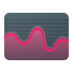
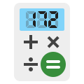

<a href="https://dahliaos.io">Website</a> •
<a href="https://dahliaos.io/discord">Discord</a> •
<a href="https://dahliaos.io/download">Releases</a> •
<a href="https://dahliaos.io/donate">Donate</a> •
<a href="https://docs.dahliaos.io">Documentation</a>

# dahliaOS Application icons

- This repository holds all dahliaOS application icons in both PNG and SVG formats.

- PNG icons come in 4 sizes, 1x (64x64), 2x (128x128), 4x (256x256) and 8x (512x512).

- The icons come in two variations, Plastic and Paper:
  - [`Plastic`](/icons/plastic/)
  

  
  &nbsp
  
  &nbsp
  
  &nbsp
  
  &nbsp
  
  &nbsp
  
  &nbsp
  
  &nbsp
  
  &nbsp
  
  &nbsp
  
  &nbsp
  
  

  - [`Paper`](/icons/paper/)
  

  
  &nbsp
  
  &nbsp
  
  &nbsp
  
  &nbsp
  
  &nbsp
  
  &nbsp
  
  &nbsp
  
  &nbsp
  
  &nbsp
  
  &nbsp
  
  

## License

  
  

Copyright @ 2019-2022 - The dahliaOS Authors - contact@dahliaos.io

This project is licensed under the [Apache 2.0 license](/LICENSE)
